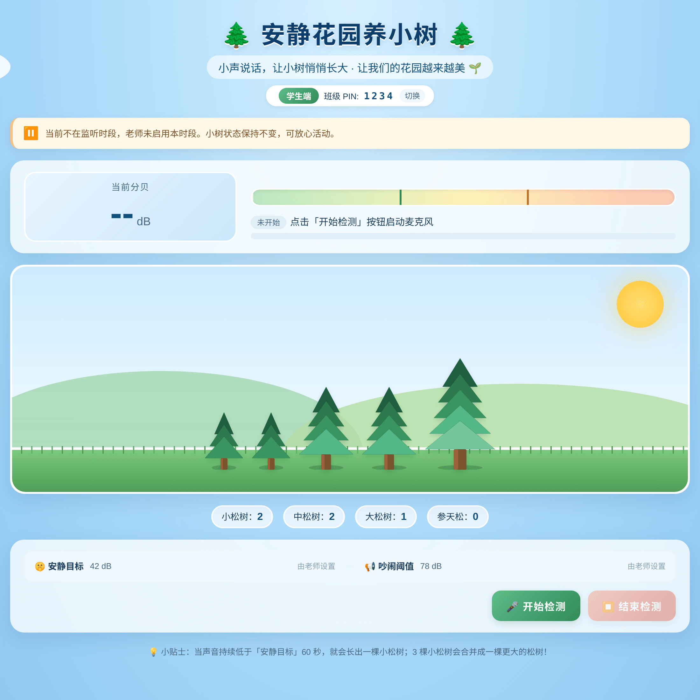
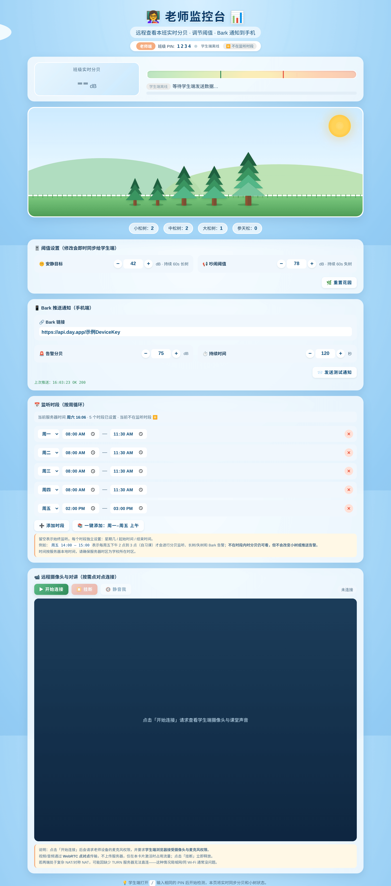
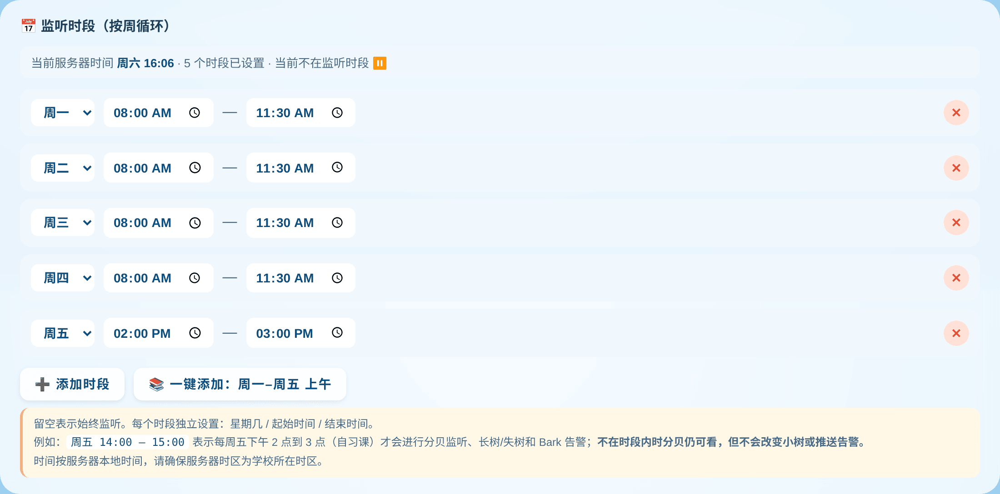
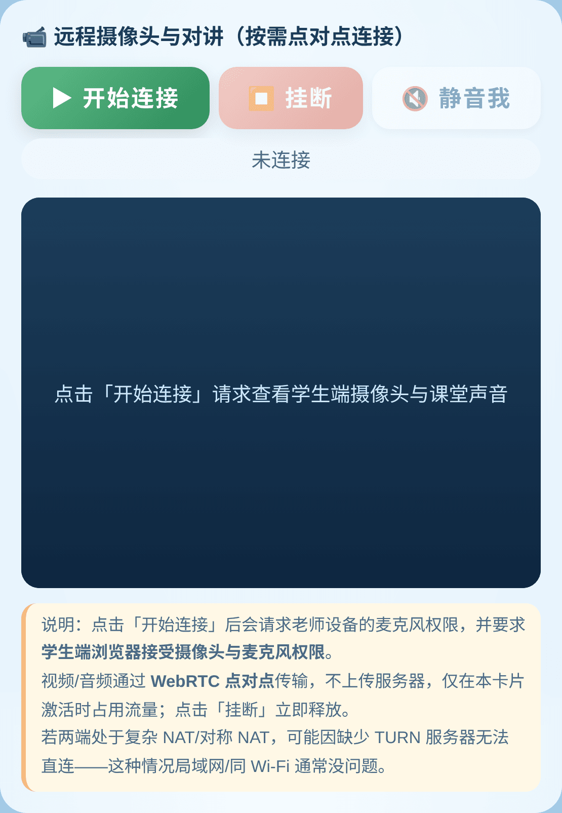
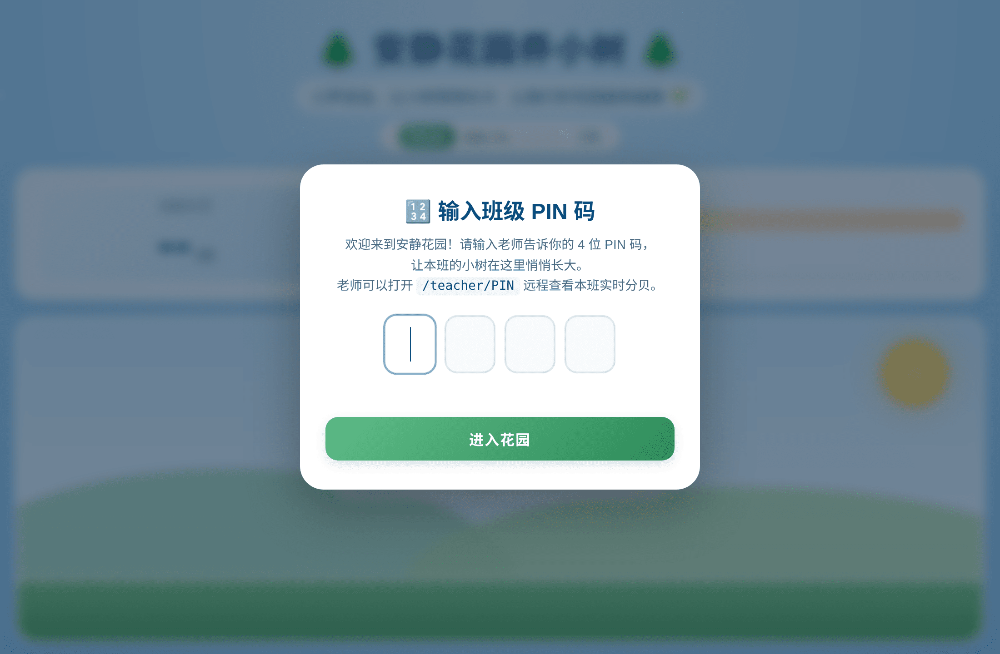
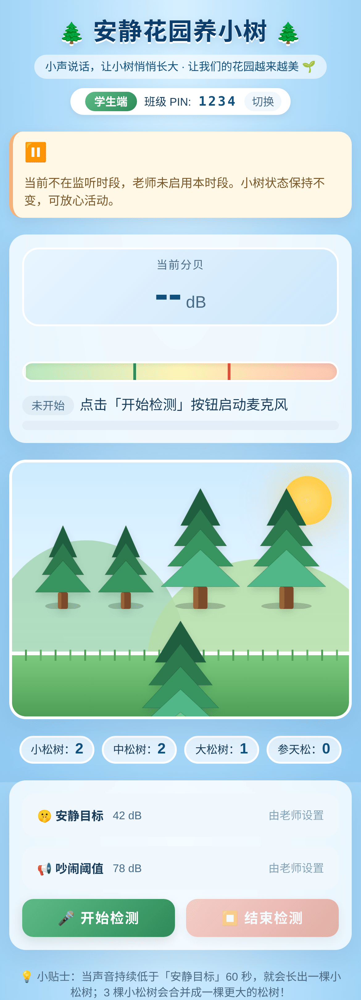

# 安静花园养小树（Quiet Garden）

> 一套面向中小学课堂的「老师工具大全」雏形项目。
> 先从「靠保持安静换小树」的小游戏起步，慢慢长成一颗包含分贝监听、定时课表、远程查看、噪音告警等功能的"老师瑞士军刀"🛠️。

  

---

## 🖼️ 界面预览

<table>
  <tr>
    <td align="center" width="50%">
      <br>
      <sub><b>学生端</b> · 教室那台电脑/大屏，实时分贝 + 花园</sub>
    </td>
    <td align="center" width="50%">
      <br>
      <sub><b>老师监控台</b> · 阈值 / Bark / 课表 / 远程对讲一站全</sub>
    </td>
  </tr>
  <tr>
    <td align="center">
      <br>
      <sub>📅 <b>每周监听时段</b>：按周循环排课，仅时段内统计与告警</sub>
    </td>
    <td align="center">
      <br>
      <sub>📹 <b>远程摄像头与对讲</b>：WebRTC 点对点，按需开启</sub>
    </td>
  </tr>
  <tr>
    <td align="center">
      <br>
      <sub>🔢 <b>4 位 PIN 区分班级</b>，多班/多老师互不干扰</sub>
    </td>
    <td align="center">
      <br>
      <sub>📱 <b>移动端响应式</b>：手机/平板自适应单列</sub>
    </td>
  </tr>
</table>

> _截图来自演示数据：班级 PIN `1234`，花园里 5 棵树（2 小+2 中+1 大），课表覆盖周一–周四上午 + 周五下午自习课。_

---

## 🎯 项目目标

让每个老师能在自己的电脑或一台小服务器上**零依赖、零运维**地跑起来。
学生端在教室一台电脑（或大屏 / Pad）打开网页，老师在自己手机或办公电脑就能：

- 看到本班实时分贝
- 在「保持安静」时长出小松树，3 棵小树合并成更大的树
- 设置每周课表，**只在自习课等指定时段**才进行分贝监听和告警
- 设置 Bark 推送，超标会立刻发到手机
- 临时点一下，**远程打开教室摄像头 + 双向对讲**

> 所有功能都已内建在一个 `server.py` 里；除 Python 标准库外**没有任何依赖**，方便老师自行部署。

---

## ✨ 核心功能

### 1. 班级 PIN 区分
- 学生端首次访问输入 4 位 PIN 码（保存在 localStorage）
- 老师端打开 `/teacher/<PIN>` 即可远程查看本班
- 不同 PIN 互不干扰，**多个班级 / 多个老师并发使用**

### 2. 分贝监听 + 小树花园
- 浏览器 Web Audio API 实时取麦克风 RMS → dB
- 持续低于「安静目标」60 秒 ⇒ 长出一棵小松树 🌱
- 持续高于「吵闹阈值」60 秒 ⇒ 失去一棵小松树 😢
- 3 棵相同等级的树自动合并成一棵更大的树（最多 4 级：小 → 中 → 大 → 参天松）

### 3. **每周课表（监听时段）** 🆕
学校通常按周循环排课。本项目支持**定义任意多个监听时段**：

```
周一  08:00 — 12:00
周二  08:00 — 12:00
…
周五  14:00 — 15:00   ← 自习课
```

**只在这些时段内**才会进行分贝监听、长树/失树、Bark 告警。
不在时段内：
- 仍然可以看到当前实时分贝（仅显示）
- **不会改变小树状态，不会发推送**
- 学生端会显示一条柔和的提示横幅

留空表示「始终监听」（向后兼容旧行为）。

时间按服务器本地时间，请将服务器时区设置为学校所在时区（例如：`TZ=Asia/Shanghai python3 server.py`）。

### 4. **远程摄像头 + 双向对讲** 🆕（按需开启 · P2P 优先 · TURN 中转兜底）
为了节省流量，**摄像头/麦克风默认是关闭的**，仅当老师点击「开始连接」时才会临时启用：

- 通过 **WebRTC** 建立连接，**优先 P2P 直连**——音视频不经过服务器，零流量成本
- ICE 自动协商：**直连失败时自动 fall back 到 TURN 中转**（需自行部署或填入第三方 TURN）
- 老师端 + 学生端都会显示 `🏠 直连` / `🌐 P2P 穿透 NAT` / `🛰 服务器中转` 实时徽章，一眼看懂当前走的什么路径
- 双向对讲：老师麦克风 ⇄ 课堂麦克风（默认开 echoCancellation 防回声）
- 任意一方点击「挂断」即立刻关闭摄像头与上行流量
- TURN 部署：参见 [`docs/coturn-setup.md`](docs/coturn-setup.md)（5 分钟版 apt 一键搞定）

### 5. Bark 推送
- 老师端填入 Bark URL（iOS App 提供）
- 设置 `告警分贝` + `持续秒数`，超标即推送到手机
- 内置冷却时间避免风暴推送
- 一键「测试通知」验证连通

### 6. 自动持久化
- 班级阈值、Bark URL、课表保存在 `settings.json`，重启不丢
- 小树状态**仅内存**保存（重启清零，符合直觉）

---

## 🚀 快速开始

### 0. 准备
- Python ≥ 3.7（标准库即可，无需 pip install）
- 一台能让学生端浏览器访问的设备（教室电脑、家用 NAS、云服务器都行）

### 1. 启动服务器
```bash
git clone <你的仓库地址>
cd quiet-tree
python3 server.py
# [quiet-tree] Listening on http://0.0.0.0:55556
```

> 默认监听 `0.0.0.0:55556`。如需修改端口，编辑 `server.py` 顶部的 `PORT`。

### 2. 学生端（教室那台设备）
浏览器打开 `http://<服务器IP>:55556/`，输入 4 位 PIN（如 `1234`），点击「🎤 开始检测」。

> ⚠️ **HTTPS 必读：** 浏览器要求**安全上下文**才允许使用麦克风/摄像头。
> - `http://localhost:55556` ✅ 可用（同机访问）
> - `http://127.0.0.1:55556` ✅ 可用
> - `http://192.168.1.100:55556` ❌ 不可用（浏览器拒绝麦克风权限）
> - `https://garden.example.com` ✅ 可用
>
> **跨设备访问的解决方案**（任选其一）：
> 1. 用 [Caddy](https://caddyserver.com/) / [Nginx](https://nginx.org/) 反代加 HTTPS（推荐）
> 2. 用 [Cloudflare Tunnel](https://www.cloudflare.com/products/tunnel/) 把内网映射出去
> 3. 用 [ngrok](https://ngrok.com/) 临时映射：`ngrok http 55556`
> 4. 浏览器开「开发者模式」白名单（不推荐生产）

### 3. 老师端（手机 / 办公电脑）
浏览器打开 `http://<服务器IP>:55556/teacher/1234`（PIN 与学生端相同）。

可以：
- 调阈值（即时同步给学生端）
- 设置 Bark URL 并测试推送
- 添加监听时段
- 点「📹 开始连接」远程查看课堂摄像头 + 对讲

---

## 🏗️ 架构

```
┌─────────────┐         POST /api/sample          ┌─────────────────────┐
│ 学生端      │ ─────────────────────────────────▶│                     │
│ index.html  │                                    │                     │
│             │ ◀────── SSE /api/stream ──────────│   server.py         │
│ - 麦克风    │ ◀────── event: signal (WebRTC) ──│   (单文件 stdlib)   │
└─────────────┘                                    │                     │
   │                                               │ - ClassState        │
   │ ─────────── WebRTC P2P (视频+音频) ────────── │ - settings.json     │
   ▼                                               │ - SSE pub/sub       │
┌─────────────┐         POST /api/sample          │ - Bark relay        │
│ 老师端      │ ◀──── SSE /api/stream ─────────── │                     │
│ teacher.html│ ◀──── event: signal ─────────────│                     │
│             │ ─── POST /api/settings ──────────▶│                     │
│ - 阈值      │ ─── POST /api/signal ───────────▶│                     │
│ - 课表      │                                    │                     │
│ - Bark      │                                    │ ┌────────────────┐ │
│ - 摄像头    │                                    │ │ Bark Cloud API │ │
└─────────────┘                                    │ └────────────────┘ │
                                                   └─────────────────────┘
```

**关键设计：**
- 服务器是**唯一权威状态持有者**（小树、阈值、课表）。学生 / 老师都是观察者 + 控制者
- 状态变化通过 **SSE** 主动推送，无需轮询
- WebRTC 信令复用 SSE 通道（用 `event: signal` 区分），媒体流走 P2P 不经服务器

### 路由

| 方法 | 路径 | 用途 |
|---|---|---|
| GET  | `/` | 学生端 |
| GET  | `/teacher/<pin>` | 老师端 |
| GET  | `/api/state/<pin>` | 班级最新快照（JSON） |
| GET  | `/api/stream/<pin>` | SSE 流：默认事件 = state，`event: signal` = WebRTC 信令 |
| POST | `/api/sample` | 学生端上报 dB：`{pin, db}` |
| POST | `/api/settings/<pin>` | 老师改阈值/Bark/课表 |
| POST | `/api/signal/<pin>` | 转发 WebRTC offer/answer/ice/hangup |
| POST | `/api/test-bark/<pin>` | 测试 Bark 推送 |
| POST | `/api/reset` | 重置花园：`{pin}` |

### TURN / WebRTC ICE 配置（settings 字段）
```json
"turnUrl":        "turn:你的域名:3478?transport=udp,turn:你的域名:3478?transport=tcp",
"turnUsername":   "quiet",
"turnCredential": "你设的强密码"
```
- 留空：仅使用公共 STUN（P2P-only，复杂 NAT 下会失败）
- 填入：ICE 仍然**优先 P2P 直连**，仅当直连失败才走 TURN 中转
- 多条 URI 用逗号或空白分隔（一般同时配 UDP + TCP 备用）

### 课表数据格式
```json
"schedule": [
  { "day": 0, "start": "08:00", "end": "12:00" },
  { "day": 4, "start": "14:00", "end": "15:00" }
]
```
- `day`: 0=周一, 1=周二, …, 6=周日（与 Python `time.localtime().tm_wday` 一致）
- `start`/`end`: 24 小时制 `HH:MM`
- `end` 必须晚于 `start`（不支持跨午夜）

---

## 📁 项目结构
```
quiet-tree/
├── server.py                       # 单文件后端（HTTP + SSE + Bark + 信令转发）
├── settings.json                   # 持久化的班级配置（自动生成，不入库）
├── static/
│   ├── index.html                  # 学生端
│   ├── teacher.html                # 老师监控台
│   ├── style.css                   # 共享样式（含手机端响应式）
│   └── garden.js                   # 花园渲染共享逻辑（pineSvg / renderTrees / …）
├── tools/
│   ├── screenshot_demo_server.py   # 截图用的 demo 服务（预置花园+课表）
│   └── screenshots.js              # puppeteer-core 自动批量截图
├── docs/
│   └── screenshots/                # README 引用的截图
├── README.md                       # 本文档
├── .gitignore
└── LICENSE
```

### 重新生成截图
```bash
# 1. 装系统中文字体（Debian/Ubuntu）
sudo apt-get install -y fonts-noto-cjk fonts-noto-color-emoji

# 2. 装 puppeteer-core（复用系统 chromium，不下载多余浏览器）
npm install puppeteer-core

# 3. 启动 demo 服务（端口 55557，预置 PIN 1234 的花园+课表）
python3 tools/screenshot_demo_server.py &

# 4. 抓图（写入 docs/screenshots/）
node tools/screenshots.js
```

---

## 🛠️ 常见问题

**Q: 学生端打开后没声音 / 显示 `--`？**
A: 一定要点击「🎤 开始检测」按钮。浏览器要求用户主动点击才能授权麦克风。

**Q: 远程摄像头连接不上？**
A: 检查（按命中概率排序）：
1. 学生端是否在线（老师端右上角小绿点）
2. 学生端浏览器是否同意了摄像头/麦克风权限
3. 老师端 + 学生端是否都走 HTTPS / localhost（http+IP 浏览器会拒绝）
4. **跨网络且 P2P 失败** → 老师端展开「⚙ 高级：TURN 中转配置」，填入 TURN URI/用户/密码。如还没有 TURN 服务器，照着 [`docs/coturn-setup.md`](docs/coturn-setup.md) 5 分钟装一套即可
5. 看徽章：连上后会显示 `🏠 直连 / 🌐 P2P / 🛰 中转`，能直接定位是直连失败还是中转失败

**Q: 课表时间不准？**
A: 服务器使用本地时间。在云服务器上务必设置时区，例如：
```bash
TZ=Asia/Shanghai python3 server.py
# 或永久设置：
sudo timedatectl set-timezone Asia/Shanghai
```

**Q: 多个班级会互相干扰吗？**
A: 不会。每个 PIN 对应独立的 `ClassState`，互相隔离。

**Q: 服务器重启后小树没了？**
A: 这是有意为之——树是当下课堂的奖励，重启相当于换一节课。阈值、Bark、课表都会保留。

---

## 🗺️ 路线图（Roadmap）

本仓库会逐步演化成「老师工具大全」。已规划/欢迎贡献：

- [x] 多班级 PIN 隔离
- [x] 实时分贝 + 小树花园
- [x] Bark 手机推送
- [x] 每周监听时段
- [x] 远程摄像头 + 双向对讲
- [ ] 课堂随机点名
- [ ] 倒计时 / 课堂秒表（投屏友好）
- [ ] 抽签分组工具
- [ ] 课堂积分 / 表扬墙
- [ ] 语音转字幕实时投屏（无障碍）
- [ ] 历史分贝曲线图
- [ ] 学生端可单设备识别多教学班

欢迎在 [Issues](../../issues) 提建议或开 PR！

---

## 📜 协议

[MIT](LICENSE) — 自由使用、修改、再分发，附上原始版权声明即可。

---

> 项目还在缓慢生长中，每个 PR 都会让这棵"老师工具树"更茂盛 🌳。
